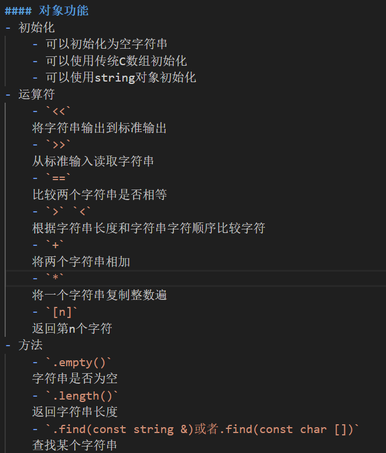
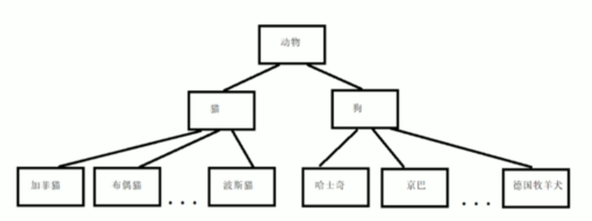

## 0.目录

## 1.预备知识
C++在C上的提升
- 保留了C过程性语言的特性
- 面向对象编程(OOP)
- 泛型编程
#### 1.1 C语言
C语言
- 是高级语言
    - 它致力于解决问题，而不针对特定的硬件（C语言可移植的原因）
    - 将低级语言的效率、硬件访问能力和高级语言的通用性可移植性结合
#### 1.2 面向过程编程
面向过程编程的核心思想
- 最关心的是如何解决问题
- 自上而下地去拆分问题，找到解决方案

> 关注的是，面对问题，如何“一步一步做”才能解决。

#### 1.3 面向对象编程
面向对象编程的核心思想
- 最关心的是解决问题需要的对象
- 自下而上，先构建蓝图，再去解决问题

> 编程时，不再首先关注“一步一步怎么做”，而是先思考“这个程序里涉及到哪些事物”，然后为这些事务创建“模板”（类），最后再通过模板生成具体的“实例”（对象）来协同工作。最后才解决问题。

#### 1.4 过程到对象的思考
由过程到面向对象语言的发展，是问题规模扩大之后的必然
因为随着问题规模扩大
- 面向过程语言
    - 必然需要越来越多针对性的方法去解决问题
    - 程序变得越来越臃肿，不可维护
- 面向对象语言
    - 不需要提供针对性的解决方案，只是从现有的类出发去解决问题
    - 程序能够灵活应对问题，维护性强

我对于C引进类于新动态分配内存关键字的看法：
它们是一个组合拳，类的引进使得动态内存的管理变得更方便，有条理。而动态内存又让程序更加灵活。还有泛型编程更是增加了这种灵活度。

#### 1.5 泛型编程
简化代码的编程模式
强调对**不同的数据类型**只用**一个函数处理**

#### 1.6 可移植性与标准
标准的制定，保证了C语言的可移植性
- C++98，为1998年通过的C++标准
- C++03，2003的标准第二版，修订了错误，但没有改变语法（因此我们使用C++98表示这两个版本）
- C++11，2011通过的标准，新增了众多特性

#### 1.7 编译过程
比较熟悉，跳过了

#### 1.x 补充
小知识
- C++是C的超集，任何C程序都可以在C++环境中运行
- C++中的++来源于C语言的递增运算符++
- C++集成了C的低级硬件访问与OOP高级抽象概念
- C++的源代码文件有多种扩展名（不只有cpp一种），具体取决于系统

## 2.开始学习C++
> 只记录我C语言没学过或者忘记的知识

#### 2.1 语句和分号
在C中，分号不是**语句之间的标识**，而是一个语句的组成部分，没有分号，语句就不完整

**补充:C语言中的语句类型**
- 表达式语句
    - 包含赋值表达式，函数表达式
- 控制语句
    - 条件判断，循环，跳转语句
- 复合语句
    - 大括号括起来的
- 空语句
    - 单独的一个分号会被视为一个空语句
- 声明语句
    - 声明变量的语句

**补充:C语言中的表达式类型**
- 算数表达式（返回计算结果）
    - 算数运算符计算数值
- 关系表达式（返回布尔类型）
    - 比较两个数值之间的关系
- 逻辑表达式（返回布尔类型）
    - 逻辑运算符连接的关系表达式
- 赋值表达式（返回赋值结果）
    - 将一个值赋给一个变量
- 条件表达式（返回符合条件的值）
- 逗号表达式（返回最后一个表达式的值）
    - 从左向右执行表达式
- 函数调用表达式（函数必须要有返回值）

#### 2.2 C语言注释于C++语言注释
- `//`，C++的注释风格
- `/**/`，C的注释风格
所以实际上，C并不是最开始就能兼容`//`的，直到C99标准才把它添加进去
使用C++注释风格更好一点，能避免问题

#### 2.3 C++的头文件
- C++头文件：无拓展名
- C头文件：以.h结尾
为了C++有兼容C的库，一般在头文件前添加'c'并去掉'.h'，如'cmath'
没有'.h'结尾的头文件，默认都是有名称空间的，这是C++的特性

#### 2.4 名称空间
相当于一个包裹，将代码打包，当日后要用到包裹中的函数时，就要指定包裹避免名称冲突
> using namespace xxx; 是一个偷懒的做法，它为方便这个特性之前出现的项目提供，这样就不需要对为适应C++对代码进行过多修改
```
using namespace xxx; //引入整个名称空间
using namespace xxx:yyy; //引入名称空间里的某个项
```

#### 2.5 运算符重载
即同一个运算符可以有不同的含义，这个含义由上下文确定
C++的特性使我们能够定义这些运算符的操作

**重载**这个词，在泛型编程里也经常被提到，我的理解是：
对于同一个符号，在不同的情况下，会做出不同的反应

#### 2.6 \n与endl的区别
endl能够保证刷新输出，而\n不能保证

#### 2.7 赋值运算符
C与C++都有这个特性，也就是赋值运算符能够连续使用
`a = b = c //合法的`
赋值将从右向左进行

#### 2.8 类简介
类是蓝图，而对象则是按照蓝图做的实体
类之于对象，就像类型之于变量

而不同的是，类型是内置于C++中，作为语言的一部分的
而类则是由用户定义的

#### 2.9 main的返回值去哪了？
将操作系统看为调用main函数的对象，main函数的返回值最后回到了操作系统
实际上，main返回0值，代表程序成功运行，非0值则表示不成功

## 3.变量类型
#### 3.1 sizeof的使用
对于类型名，sizeof必须要加括号
对于变量名，sizeof的括号是可选的

#### 3.2 大括号初始化方式
```
int var1{5};
int var2 = {6};
```
以上是大括号初始化器的两种使用方法，等号是可选的
同时，空大括号将变量初始化为0

#### 3.3 整形常量的三种表示方式
```
int var1 = 123;
int var2 = 0123;
int var3 = 0x123;
```
整形常量，以1开头表示十进制，以0开头表示八进制，以0x开头表示十六进制

```
cout << hex;
cout << oct;
```
使用cout时，输入控制符hex以十六进制显示，oct以八进制显示
在再次切换之前进制进制显示设置一直有效

#### 3.4 类型大小
整形
- short 至少16位
- int 至少与short一样长
- long 至少32位，且至少与int一样长
- long long 至少64位，且至少与long long一样长
> 在windows下，int与long都位32位
> long long为64位

浮点形
- float 32位，其中1位符号位，8位指数位，23为尾数位
- double 64位，其中1位符号位，11位指数位，52位尾数位
> 在C中，使用0.1 + 0.2 == 0.3得到的的将是false
> 因为浮点数并不能精确地表示0.1与0.2
> 最后相加的结果不等于0.3的字面量值

#### 3.5 C++数值转换
C++转换自动执行的情况
- A类型赋值给B类型时
- 同一表达式存在不同类型的值时
- 给函数传递参数时

数值转换时缩窄（narrowing）的情况
- double->float
- 浮点->整形
- 大整形->小整形

```
char a{1234} //不允许
char a = {12} //允许，因为没有缩窄
```
使用{}初始化，它会严格检查类型，不允许缩窄的情况

表达式中的转换
可以简单地这样理解：取表达式里最大的类型，将其他类型都转换为此类型

强制类型转换
```
(long) a // 为表达式，返回转换为long类型的a值
long (a) // 函数调用版
```
同时C++还有更严格的类型转换方法
```
static_cast<int>(a) // 返回a的int类型
```

## 4.复合类型
> 复合类型，由基本类型构成
> C++中的复合类型包括
> 数组
> 结构
> 指针
> 类
#### 4.1 拼接字符串常量
C++中，由空白字符分隔的字符串常量都会被拼接为一个

#### 4.2 读取一整行
```
cin.getline(size, ptr); //读取一整行，并丢弃换行符
cin.get(size, ptr); //读取一整行，并将换行符留在输入流中
```
表达式返回cin对象，因此，读取两行可以这样使用
`cin.getline(size, ptr).getline(size, ptr);`

#### 4.3 string类简介
C++98标准新增了string类型
对于字符串，string隐去了数组特性，让它更像普通类型
下面程序展示了基于string类型的IO方法
```
    string fName; //不需要提前指定大小，大小可变
    string lName;
    string description{"description: "} // 同样也可以初始化;
    string container;

    cout << "Enter your first name and last name:" << endl;
    getline(cin, fName), getline(cin, lName);
    // cin没有处理string的方法，所以需要额外使用getline

    cout << "Enter your desciption" << endl;
    getline(cin, container);
    description += container; // 忽略数组特性，像对象一样操作

    cout << "your name is: " << fName << " " << lName << endl;
    cout << description << endl;
    cout << description[2] << endl;
```

#### 4.4 枚举
```
enum orientation{west, east, north, south};
enum {left, right, up, down};
```
一次性定义多个整形常量
也可以给枚举取名，限定枚举变量的值

#### 4.5 使用new分配内存
```
int * newptr = new int;
int * newarray = new int [10];
int * mallocptr = malloc(sizeof(int));

delete int;
delete [] int;
free(mallocptr);
```
new，是C++提供的新关键字，用于动态分配内存
它与malloc的不同点在于
- new分配的是称为“堆”的自由内存，malloc是“栈”内存
- new分配的内存必须用delete释放，malloc需要free
- new分配的数组，必须要用数组形式对应释放

#### 4.6 auto类型的使用方法
`auto container = /*一个指向存放整形数组指针数组的指针*/`
在变量类型复杂时，可以直接用auto代替

#### 4.7 vector与array模板类简介
```
vector<int> vi(n); // n可以是变量
array<double, n> vd; // n可以是变量
```
vector与array提供了动态管理数组的功能，可以代替数组而且更安全
可以使用vector与array的类方法来动态分配数组，将在后面提到
但是vector相比于数组，处理时间更长一些

## 5.循环与关系表达式

#### 5.1 副作用与顺序点
顺序点，是程序执行过程中的一个点，进行下一步之前确保对所有副作用都做出了评估
在C++中，语句中的分号就是一个顺序点
同时，任何完整表达式的最后都是一个顺序点
如`while (i++ < 5)`，i++ < 5是一个完整条件表达式，因为他是while循环的测试条件

#### 5.2 编写延时循环
头文件`ctime`中提供了clock_t类型与CLOCK_PER_SECOND常量
目的是为了统一ctime在不同系统上的运行结果
```
    float seconds;
    cout << "Enter the delay time, in seconds:";
    cin >> seconds;
    clock_t delay = seconds * CLOCKS_PER_SEC; // 计算延时的时间戳

    cout << "delaying..." << endl;
    clock_t start = clock();
    while (clock() - start < delay); // 这种循环等待的方式实际上会占用电脑大量资源

    cout << "done!" << endl;
```

#### 5.3 基于范围的for循环
```
double x[4]{0.1, 5.0, 2.3, 4.2};

for (double i : x) // x必须是数组或者容器类型
    cout << i << " ";
cout << endl;
```
对于使用for循环遍历容器元素，C++11提供了遍历的新特性

## 6.输入与输出

#### 6.1 getchar()与putchar()的代替
```
cin.get();
cin.put(ch);
```

#### 6.2 cin.get的重载类型
cin.get有三种重载类型
- `ch = cin.get()` 不传递任何参数，读取一个字符，返回读取的字符
- `cin.get(ch)` 传递一个char类型参数，读取一个字符，返回cin的引用，可以直接用作判断条件
- `cin.get(str, size)` 传递一个c风格字符串与大小，读取一整行，并将换行符留在输入里，返回cin的引用

#### 6.3 文件尾条件
使用文件尾条件作为循环结束条件
**要判断读取完毕，相比于读特定字符，此方案使用场景更广泛一些**

同时，键盘输入可以通过ctrl + z来模拟文件结尾

```
cin.eof(); // 检测输入流是否到文件结尾
cin.fail(); // 检测是否读取失败(包含读取到文件结尾的情况)
cin.bad(); // 检测读取时是否发生严重错误
cin.good(); // 检测读取状态是否正常
```
以上四种cin的方法可以检测cin的读取状态
四种状态都是在读取后判断，也就是执行一次读取操作后，再判断状态
读取到eof时，eof与fail状态都是1

同时，可以将cin对象作为一个布尔值使用
如`if (cin)`，这将返回cin的读取状态

对循环结尾条件的理解
流程：先读取->再判断是否达到结束条件
`while (cin >> temp)`与`while((ch = cin.get()) != EOF)`
实际上是将“读取”与“判断”的操作合成一句了
先从输入流读取，再判断是否读到文件结尾

#### 6.4 将文件作为输入输出流
c++提供了fistream/fostream类，它给我们提供了文件读取类似cin与cout的接口
统一了文件输出输入和标准输入输出流的操作
```
#include <fstream>
#include <iostream>
#include <vector>
#define IFILE "Avg.in"
#define OFILE "Avg.out"
#define NAMESIZE 1024

int main(void)
{
    using std::cout, std::cin, std::endl, std::vector;
    std::ofstream outFile;
    std::ifstream inFile;
    vector<double> data;
    double temp, res = 0.0;

    outFile.open(OFILE); // cin与cout是单例，但fsteam类可创建多个对象
    inFile.open(IFILE);

    if (!inFile.is_open() || !outFile.is_open()) // is_open方法判断是否打开成功
    {
        cout << "Unable to open "
        << IFILE << " or "
        << OFILE << endl;
        exit(EXIT_FAILURE); // 没有打开成功所以不用关闭
    }

    while (inFile >> temp) // 只要还有数据，
    {
        data.push_back(temp);
        res += temp;
    }

    if (inFile.eof()) // 跳出循环，检查状态（读取完成之后发生的）
    {
        if (data.size() == 0)
            cout << "No value readed!" << endl;
        else
        {
            cout << data.size() << " value" << (data.size() > 1 ? "s " : " ") << "readed" << endl;
            cout << "The avg is: " << res / data.size() << endl;
            cout << "Now putting results to " << OFILE << endl;

            // 像cin/cout一样使用
            outFile << data.size() << " value" << (data.size() > 1 ? "s " : " ") << "readed" << endl;
            outFile << "The avg is: " << res / data.size() << endl;

            outFile.close();
            inFile.close();
            exit(EXIT_SUCCESS); // 成功执行
        }
    }
    else if (inFile.fail())
        cout << "Type dismatch!" << endl;
    else
        cout << "Unknown Error!" << endl;

    outFile.close();
    inFile.close();
    exit(EXIT_FAILURE);
}
```
**补充：exit()与return的区别**
- exit与return的级别
    - return是语言级别的，它将控制权交给上一个调用的函数
    - exit是系统级别的，它将控制权交给操作系统，返回值也是
- exit与return的行为
    - 在main函数中，exit与return行为几乎一样
    - 而在main函数之外，exit能直接将控制权交给系统
- 最后，在main函数里使用return其实最后也会调用exit函数

## 7.函数

#### 7.1 数组参数传递
使用数组对函数传参时，必须同时传入数组指针与数组大小
```
f_show(const double array[], int n); // 使用const显式指定数组不会被修改
f_modify(double array[], int n); // 使用[]说明array是一个数组
```
如果使用容器类vector或者array就不会出现需要传递数组大小的问题
直接使用.size()方法获取大小即可

#### 7.2 使用数组区间的函数
另一种传递数组范围的方法，是两个指针定义开始与结束的区间
通常，结束指针被规定为“超尾”的，指向要处理的末尾值的后一位
对于要处理数组区间的函数来说，这个更像是一种语法糖
因为不需要通过开始指针和处理个数来指定区间

#### 7.3 常量指针的传递
常量指针指向的变量不能被修改，就算变量本身不是常量

函数参数传递时：
const \* -> const \* (√)
\* -> const \* (√)
const \* -> \* (x)
所以声明函数时，尽量在应该使用const指针的地方使用它
这样能确保同时兼容

```
const int * array;
int * const array;
```
语句一表示，指针指向的是一个const量，不能通过指针修改这个量
语句二表示，指针是一个const量，不能修改这个指针指向的地址

同时，教材还给出了一个很离谱的例子
我们来逐步分析下
```
const int **pp2 // 指向常量int的指针的指针
int * pp1; // 指向int的指针
const int n; // 常量int

pp2 = &pp1; // 可以，将int指针赋值给常量指针
*pp2 = &n; // 可以，常量指针接受常量指针
*pp1 = 10; // pp1不是常量指针，但得到了常量指针的地址，这样就可以用非常量指针修改常量
```
因此，在使用指向指针的指针时，一般不使用const

#### 7.4 二维数组传参
首先区分一下定义
(注：[]的优先级要高于*)
- `* a[3]` 大小为3的数组，数组里存了指针
- `(*a)[3]` 指针，指向大小为3的数组
- `a[][3]` 同上面的
- `(*a)[i]` 指针，指向变长数组

#### 7.5 auto与typedef对类型的简化
当一个类型特别复杂时，可以使用typedef来定义，之后每一次引用typedef即可
同时也可以使用auto类型，来自动判断

## 8.函数进阶

#### 8.1 C++内联函数
适用情况：函数本身代码执行时间很短，但需执行多次的情况
它的适用范围和#define的宏定义函数很像，但前者行为更像一个函数，功能更强大
`inline int add(int a, int b)`内联函数的例子
注：内联函数无法递归，但既然你都内联了，为啥还要递归

#### 8.2 引用变量
引用除了隐式使用指针的功能外，还有其他特性
- 引用必须在声明时赋值，且引用完不能更改引用的指向
    - `int & num = a;` 相当于 `int * const num = &a;`
- 引用创建的对象，其功能和变量原型一样，只不过换了名字
    - 例如`int & num = a;`然后`&num`，&num效果与&a相同

引用变量在函数参数传递当中的应用
- 和传递指针的行为类似
    - 只不过省去了传参时求地址和使用时解引用的操作
- 在传递大规模数据时
    - 使用`const int & num = a`来定义常量引用
    -   再给函数传递参数时，能够保证大数据不被再拷贝一遍，也能保证源数据不被修改

注意：引用在参数传递时，更多的是针对结构或者类给函数传参的情况

#### 8.3 在函数中使用引用
`const ob & accumulate(ob & a, const ob & b)`
该函数声明：
- 传递一个ob类型的引用a，可修改
- 传递一个ob类型的引用b，不可修改
- 返回一个ob类型的引用，且该引用不可当作赋值符号左值
    - 例如`accumulate(a, b) = c`，若返回值不是const类型，则返回对象会被修改为c的值

同时，不能将函数内的变量当作引用返回，如
```
ob & foo(ob & a)
{
    ob b;
    return b; // 错误的，因为离开函数b就会消失
}
```
正确的做法是将参数中的引用返回

#### 8.4 对象、继承与引用
基类引用可以指向派生类对象

最经典的例子如iostream与iofstream
iofstream由iostream派生而来，在函数参数传递时，可以用iostream & 的引用，同时接受iostream对象与iofstream对象

#### 8.5 补充：cout输出格式
下面是个人感受：
格式个鸡毛！要格式用printf，方便得多效率还高
cout太鸡肋了，对于一个格式转换需要多次使用切换模式的方法

#### 8.6 何时使用引用参数
不修改原数据
- 如果是内置数据和小型结构，按值传递
- 如果是数组，使用const指针
- 如果是较大结构，使用const指针或者引用
- 如果是类对象，使用const引用，因为这样可以使用类的其他特性

修改原数据
- 如果对象是内置数据类型，则使用指针
- 是数组，则只能使用指针
- 是大型结构，则使用指针或者引用
- 是类对象，使用引用

只是指导原则，根据情况做出最合适的选择

#### 8.7 默认参数
在声明函数时，可以指定某些参数的默认值
如`int add(int a, int b = 1)`，这样，如果调用add(1)，返回的结果将是2

默认值只能被设置在最后，且使用时也得按顺序传递，不能跳过

#### 8.8 函数重载
函数特征标：函数的参数列表
函数重载的条件：函数同名，但特征标不同
注意：一个参数是否是同类型的引用，不会改变特征标

重载引用参数
```
void sink(double & var); // 接受可修改的左值
void sink(const doule & var); // 接受不可修改的左值
void sink(double && var) // 接受右值
```

#### 8.9 函数模板
当一种算法对于所有类型的变量都有效时，就可以用到函数模板了
如swap函数
```
template <typename type>
void myswap(type & a, type & b)
{
    type temp = a;
    a = b;
    b = temp;
}
```

对于函数定义的优先级
非模板版本 > 显式具体化模板 > 模板版本

```
void Swap(double & a, const double & b) // 非模板版本
{
    a += b;
}

template <typename type>
void Swap(type & a, type & b) // 模板版本
{
    type temp = a;
    a = b;
    b = temp;
}

template <>
void Swap(double & a, double & b) // 显式具体化版本
{
    a += b + b;
}
```

接下来介绍几个重要的概念
**模板**
并不是一个实际的函数声明，有点像class类的定义
它接受一个特定的类型，再根据模板为这个特定类型创建函数声明

**模板的显式具体化**
当模板需要对特定类型的数据进行特定处理时
则需要使用显式具体化单独定义，如
```
template <>
void Swap(double & a, double & b) // 显式具体化版本
{
    a += b + b;
}
```
使用前提：必须有对应的函数模板

**模板的显隐式实例化**
实例化可以理解为，用特定类型替换typename定义的类型
替换后的函数模板再声明一个函数，如
```
int类型替换后的Swap
void Swap(int & a, int & b) // int类型的一个实例
{
    a += b + b;
}
```

每一次传特定类型的参数，就相当于一次隐式实例化
如`Swap(i, j)`这是一种隐式实例化，若ij为int类型，则创建了一个int类型的函数模板实例

当然，也可以显式实例化，如
`template void Swap(int & a, int & b)`为模板创建了一个int类型的实例
`Swap<int>(a, b)`也是一种显式实例化

**C++函数重载解析**
重载解析，即同名函数，根据传参的不同，寻找最适合的函数方案
重载解析的大致过程
- 使用候选的函数列表，包括所有同名的函数与函数模板
- 从中筛选形参和实参匹配的函数
- 确定最佳的可行函数，如果有就调用，没有就报错
    - 从最差到最佳的顺序如下：
    - 完全匹配，但常规函数优先于模板
    - 提升转换，如float到double
    - 标准转换，如int到char，long到double
    - 用户定义的转换，如类中自定义的变量转换
        - 完全匹配的几种平行情况
            - Type 到 Type &
            - Type & 到 Type
            - Type [ ] 到 * Type
            - Type(函数参数) 到 Type(*)(函数参数)
            - Type 到 const Type
            - Type 到 volatile Type
            - Type * 到 const Type
            - Type * 到 volatile Type *
        - 多个完全匹配的优先情况
            - const Type与Type，取决于实参是否是const
            - 两个模板函数，选择具体化的那一个

**新增关键字decltype**
在书的P295，内容有点偏，以后用到了再去翻

#### 8.x 第八章做题收获

**知识点1**
```
template <typename type>
type maxn(const type a[], const int n)
{
    type maxMember = a[0];
    for (int i = 0; i < n; i++)
        if (a[i] > maxMember)
            maxMember = a[i];
    
    return maxMember;
}

template <>
char * maxn(const char * a[], const int n)
{
    char * maxMember = a[0];
    for (int i = 0; i < n; i++)
        if (strlen(a[i]) > strlen(maxMember))
            maxMember = a[i];
    
    return maxMember;
}
```
乍一看，第二个模板具体化没有任何问题，但编译以后仍然提示没有找到匹配模板
问题出在`const char * a[]`与`char * const a[]`的解析区别
C++对复杂表达式的解析方法：右左法则 (right-left rule)：
从变量名开始，先看左边再看右边，遇到括号则先处理括号内部，直到整个声明解析完毕

对于情况1，顺序为a[]，a是数组 -> *，它存储指针 -> const char，指针指向const char
对于情况2，顺序为a[]，a是数组 -> const，它存储常量 -> char *，常量是char *

第一条表示，a是一个指针数组，**指针指向的内容**是不可修改的
第二条表示，a是一个指针数组，**指针的指向**是不可修改的

再来看第一个函数模板的定义，符合第二条，即指针的指向不能修改
则函数声明需要修改为
`char * maxn(char * const a[], const int n)`

是否可以从这里延申开来理解复杂指针定义的问题？（C陷阱与缺陷2.1节）

**知识点2**
```
    cout << "Enter something (q to quit):" << endl;
    while (getline(cin, container)) 
    {
        if (container.size() == 0)
            continue;
        if (container[0] == 'q')
            break;
            
        cout << "Enter something (q to quit):" << endl;
    }
```
函数要实现的逻辑：不断读取用户输入，直到遇到EOF或者q退出
这是一个错误的程序示例，因为它不能处理以q打头的字符串
也就是说，结束程序需要的输入 实际上包含了 用户想要处理的输入

正确且简洁的做法是`while (getline(cin, container) && container != "q")`
空的string也能用于比较，所以不需要额外判断

## 9.内存模型与名称空间

#### 9.1 头文件中的内容
- 函数原型
- #define或者const定义的符号常量
- 结构声明
- 类声明
- 模板声明
- 内联函数

#### 9.2 存储持续性、作用域与链接性

**C++中的四种变量持续性**
- 自动存储持续性：C++自动管理这些变量的内存空间
- 静态存储持续性：在程序运行的整个周期内都存在
- 线程存储持续性：在线程的运行周期内存在
- 动态存储持续性：在运行过程中，使用new与delete关键字来动态分配内存

**C++中的作用域**
- 局部作用域
    - 只在特定范围内有用
    - 代码块内
    - 类内
    - 名称空间内
- 全局作用域
    - 整个程序都可见

**C++中的连接性**
只有静态存储的变量有连接性
- 外部链接性
    - 可在不同文件间共享
- 内部链接性
    - 只能在一个文件中的不同函数内共享
- 无链接性
    - 只能在代码块中被访问

**补：auto与register关键字**
在老版本的C++与C中，auto用于显式声明变量存储周期为自动的
但程序员几乎不用
所以在C++11中，auto被赋予了更新的含义，也就是自动判断类型

同样的register在老版本C与C++中，表明将变量放在寄存器中
但在C++11中，register的提示作用失去了，它的含义变成了auto之前的含义

真是一对苦命鸳鸯

**静态变量的初始化**
一般只使用常量来初始化静态变量
且过程为：静态变量先初始化为0->初始化为给定的常量

**确定具体变量的类型**
存储周期、作用域、链接性这一块太绕了
为简化，可以使用以下规则：
1. 变量作用域可以不用管，因为这个很明确
2. 确定函数是静态还是自动
3. 确定函数是外部链接还是内部链接，且用extern和static写明

#### 9.3 说明符与限定符
存储说明符
- auto
- register
- static
- extern
- thread_local
- mutable

cv限定符
- const
- volatile

**volatile**
虽然在程序运行过程中不会修改变量的值，但它仍然会改变（如指向系统时钟的指针）
对于使用volatile的常量值，若要使用它两次，则会重复查找它两次
而不适用volatile的常量值，则不需要重复查找（编译器优化）

**mutable**
虽然结构体为const类型，但其中的某个值仍然可以修改

**const新特性**
用在外部定义的常量上，将外部定义变量的链接性设置为内部的
如外部定义的`const int N = 1e5 + 10;`
实际上等同于语句`static const int N = 1e5 + 10;`
若将此定义包含在头文件中，则可以给每个包含该头文件的文件，定义一个内部链接性的常量

但若希望某个常量的链接性为外部的，则可写为：`extern const int N = 1e5 + 10`，使用extern覆盖const

#### 9.4 存储方案与动态分配
使用new与delete关键字来使用动态内存
动态内存的类型不是先进后出（栈），而是一个自由分配的内存块（堆）

**给new分配的内存设置初始值**
`double * dp = new double {2.0} // 大括号可对单值和多值内存初始化`

**new运算符的本质**
`void * operator new(std::size_t);`
`void * operator new[](std::size_t);`
这里使用到了C++中运算符重载的特性
则每一次使用`new int`时，实际等同于`new(sizeof(int))`

由于new操作符"可替换的"的特性，用户也可以定义自己的new操作符

**定位运算符new**
要使用定位运算符new，则需要引入头文件`#include <new>`
`double * dp = new (buffer) double[N];`
使用定位运算符new时，需要传递一个静态内存的地址，同时因为内存是静态的，不需要调用delete删除内存
我认为，这只是显式地在操作已经分配好的静态内存，算不上是动态分配

#### 9.5 名称空间
我对名称空间的理解：
单独分配出来，用于存储定义的代码块，需要时就从指定代码块内取出定义并声明，对声明处的作用域有效

名称空间必须是全局的，或者定义在另一个全局的名称空间里
所以默认情况下，名称空间里声明的名称的链接性都为外部的

**namespace运用**
```
namespace Hansen{
    void sleep(int hour){
        ...
    }
    bool happy = 1;
    int age;
}
```
可声明一个名称空间，

**using运用**
使用using导入名称空间后，可以不用每一次都指定某个特定的名称空间
`using namespace::var`使用名称空间里的某个特定值
`using namespace std`使用整个名称空间

**命名空间的使用规则**
这个规则是针对大型项目的
所以在小型项目里使用编译using也是可以接受的
- 使用在已命名的名称空间中声明的变量，而非外部全局变量
- 使用在已命名的名称空间中声明的变量，而非静态全局变量
- 开发了一个函数库或者类库，应放在名称空间中
- 仅将编译using作为一种兼容旧代码的特殊工具
- 不在头文件中使用using命令
- 导入名称时，应在局部导入，并且使用作用域解析和using声明的方法

## 10. 对 象 和 类
最重要的OOP特性：
- 抽象
- 封装和数据隐藏
- 多态
- 继承
- 代码复用

#### 10.1 面向过程编程和面向对象编程的区别
面向过程：
首先考虑该如何用代码表示方法，该使用何种方法读入并存储数据，最后该如何编写方法对数据进行操作

面向对象：
首先考虑如何表示数据，如如何表示一个垒球队员，如何表示一个垒球团队，然后在使用数据建立对象的基础上，再思考能对对象进行何种操作

#### 10.2 C++中的类
类规范由两个部分组成：
- 类数据成员与方法声明（类的蓝图）
- 方法的具体定义（类的细节）

**什么是接口**
我的理解是，可以把C++中的类想象成一个封闭的盒子
接口，也就是类中的公共方法，为这个盒子提供了交互的按钮
用户按下按钮，并输入数据，盒子进行相应的响应

**什么是封装**
将抽象接口与具体实现分开的行为
如：将数据隐藏、在创建类时只提供方法声明，而将具体实现放在另一个文件中

**类和结构**
C++中类和结构唯一的区别是，结构默认访问类型是public，对象是private
但结构一般被用来存储单纯的数据对象，被称为普通老式数据结构

**内联函数**
C++中，其定义位于类声明中的函数会被自动转化为内联函数
因此，此类函数的代码一定要短小

同时，如果不在声明中添加内联函数的定义的话，需要在定义类的头文件里定义，这样才能将内联函数设置为所有文件可见
可以将内联函数的链接性视为内部链接性

**客户/服务器模型**
客户->使用类的用户
服务器->类接口的提供者
原则：
客户责任是了解服务器的接口，而不必了解具体实现
服务器的责任是确保服务器接口准确可靠地执行

#### 10.3 类的构造与析构函数

**构造函数**
C++在为类新建一个对象时，会自动调用类的默认构造函数
一般来说，类的默认构造函数长这样：`Stock::Stock() { }; // 没有返回值`
构造函数的名字与类的名字一样

但是我们也可以手动定义构造函数
可以像这样`Stock::Stock(const string & tarStr, int n);`
这样自定义的构造函数，在每次新建对象时可自动调用

创建自定义构造函数后，C++并不会保留原来的默认构造函数
意味着你不能单纯使用`Stock stock;`来新建一个对象
这时候需要在手动提供一个类似默认构造函数的函数

**析构函数**
对象过期后，程序会自动调用的函数
如果构造函数使用new为对象分配内存，则可在析构函数里编写delete来删除内存
析构函数也有默认函数，声明为：`Stock::~Stock();`
同样可以自定义析构函数，但自定义的析构函数也不接受任何参数

**const成员函数**
`void stock::show(void) const;`
后面的const确保此函数不会修改对象的内容
应从现在开始遵循这个标准

**this指针**
对于每一个成员函数，C++都会隐式地传递一个this指针
这个指针指向当前对象的地址

**抽象数据类型**
类很适合用于构造抽象数据类型

## 11.使用类

#### 11.1 运算符重载
在类中使用`operator *()`来重载一个运算符
注：运算符必须本来在C++中有效

**使用重载运算符的限制**
1. 运算符至少有一个操作值是用户定义的类型
2. 运算符不能违背原来的语法规则，优先级也保持不变
3. 不能创建新运算符
4. 有不能重载的运算符，见387页
5. =、()、[]、->只能重载为成员函数

#### 11.2 友元
友元是C++提供的另一种访问类私有部分的方法
可以解决非成员函数不能访问类私有部分的问题
友元函数有与成员函数一样的访问权限，但却不能类的成员运算符来调用

**创建友元函数**
需要在类里提供函数声明`friend Time operator*(const double n, const Time & t);`
然后在类外提供函数原型，不需要加friend关键字，因为friend关键字是在类里使用的

**重载运算符的友元与成员问题**
现有两种定义
`Time operator +(const Time & t) const;`
`friend Time operator +(const Time & a, const Time & b);`
这两种定义实现的功能是一样的
对于第一种，其中一个Time对象通过this指针隐式传递
对于第二种，两个Time对象都显式传递

**一元与二元运算符**
对于有一元与二元形式的运算符，可以将其重载为一元或者二元形式
对于只有二元形式的运算符，只能将其重载为二元
如'-'号
`void operator -(void);`一元形式
`void operator -(const Var & var)`二元形式

#### 11.3 类的类型转换

**在类中定义的隐式转换**
**自定义类=基础类**
只有一个参数的构造函数会被用作转换函数
`Time(const double var);`或`Time(const int var, int mode = 0);`
来使用如`Time time = 1.3, time = 13;`这样的隐式转化

**基础类=自定义类**
需要在类定义里声明类似
`operator double() const;`的函数（注意：不需要返回值）
`Time::operator int() const { return int (var); }`提供自动转换的具体方法
来实现`double var = time, int var = time;的隐式转换`

同时，可以添加`explicit`关键字，防止无预期的隐式转换，而强制使用显式转换

## 12.类和动态分配内存
#### 12.1 动态内存和类

**对于类中静态成员的使用**
`static int numStrings;`
类中静态成员，被所有对象共用
也就是无论有多少个对象，numStrings参数只有一个，且被所有对象共用

如果要初始化，则需要在类外初始化
`int StringBad::numStrings = 0;`
因为类只是指定内存如何分配，并没有实际上分配内存
但如果静态类型是const类或者枚举型，则可直接在类中初始化

**C++中的特殊成员函数**
就是不提供定义，但程序会自动提供的函数
- 默认构造函数
- 默认析构函数
- 复制构造函数（也是构造函数的一种）
- 赋值运算符
- 地址运算符

前两个好理解，为什么会有后面三个？
自己想想，自己新定义了一个类后，是不是可以直接使用等号赋值，以及使用地址运算符求地址？
但是按理来说，对这些操作符来说，这是一个新的类，对这个类应该没有对应的操作才对
所以C++提供这些特殊成员函数，就是为了**简化类的编写**

**复制构造函数**
`StringBad sailor = sports;` 将用已有对象初始化新建对象
相当于直接调用复制构造函数`StringBad(const StringBad & obj)`

**赋值运算符**
```
StringBad sailor;
sailor = sports;
``` 
将已有对象赋值给另外一个已有对象
相当于调用赋值运算符`String & operator =(const StringBad & obj)`

- 复制构造函数
    - 调用条件
        创建对象副本时，都会调用复制构造函数
        如，用已有对象初始化新对象时，或者函数按值传递时
    - 默认复制构造函数
        - 功能：逐个赋值成员的值到对象副本
        - 问题：如果值是指针，则两个对象的指针将指向同一个地址
            可能会导致一个空间被释放两次，这叫做浅拷贝
    - 自定义复制构造函数
        - 功能：可以自定义功能
        - 优点：对于指针指向的结果可以深拷贝
- 赋值运算符
    - 调用条件
        对象赋值给另外一个对象
        如，使用'='，显式地将对象的值赋给已存在的对象
    - 默认赋值运算符
        同样是逐个复制，浅拷贝
    - 自定义赋值运算符
        自定义复制操作，深拷贝

#### 12.2 实践：编写一个String类型
**new与delete的注意事项**
如果是delete [] str，则需要在初始化时使用new char[1]来兼容（而不是new char）

**中括号操作符的注意事项**
对于中括号运算符，第一个参数在括号左边，第二个参数在括号中间
例子，对于函数：
```
char & operator [](int i)
{
    return str[i];
}
```
将返回私有数据str第i个字符的引用

**const函数特征标**
对于函数：
```
const char & operator [](int i) const
{
    return str[i];
}
```
const特征标的作用有：
- 标识函数不会修改数据
- 对于const类型的对象，只能使用有const标识符的方法
    - 也就是说，当对象是const类型时，使用[]运算符会调用这个方法

**有关返回对象的说明**
- 返回指向const对象的引用
使用情况：参数的对象是const类型，同样需要通过const类型引用返回
- 返回指向非const对象的引用
使用情况：重载赋值运算符
- 返回对象
使用情况：要返回的对象是局部变量，则需要一整个对象来传递
- 返回const对象
使用情况：不想让用户对返回对象进行操作的情况

**对象指针使用**
- 指向已有对象的指针
`String * ptr = &str1;`
- 指向新建对象的指针（通过new新建对象）
`String * ptr = new String(str1);`
这里使用复制构造函数新建了一个对象，并且返回了对象的指针
相应的，delete删除创建的变量，提供指针即可
`delete ptr;`

**类内静态成员**
`static size_t stringCount;` 静态变量
`static size_t getStringCount();` 静态函数

- 静态成员
    静态成员不属于任何一个特殊的对象，而是被所有对象共用
    - 静态变量
        需要在类内声明它的存在，随后，需要在类外初始化
        `size_t String::stringCount = 0;`
        这里是定义（分配内存），而不是改变stringCount的值，因此，即便stringCount是private，此语句仍然成立
    - 静态函数
        通常用来获取静态变量
        不能通过某个特定的对象调用，而是使用`String::getStringCount()`调用

#### 12.3 实践：实现ATM等待时间预测

**类的接口**
在编写一个类之前，首先需要考虑类需要哪些接口，然后再着手实现相关代码


**类内声明嵌套结构**
如果一个结构只希望在类内使用的话，可以只在类内定义
如，Queue类内的Node结构
```
class Queue
{
private:
    struct Node
    {
        Item item;
        Node * next;
    };
};
```

**成员初始化列表**
```
Classy::Classy(const int n, const int m) : mem1(n), mem2(n * m)
{
    ;
}
```

成员初始化列表用于构造函数，可以在创建对象实例之前，对变量进行初始化
特点是初始化的值可以由用户提供
注意以下几点：
- 这种格式只能用于构造函数
- 必须用这种格式初始化非静态常量成员
- 必须用这种格式初始化引用成员

**伪私有方法**
在类中：
```
private:
    Classy(const Classy &);
    const Classy & operator= (const Classy &);
```
将复制构造函数和赋值构造函数都设置为私有
即可禁止用户使用这两个函数

## 13.类与继承
从这章开始我将跟着视频学习，C++ primer plus讲的太繁杂了
#### 13.1 初识继承
**继承好处**
对于有共性同时有特性的对象，可以是用继承的方法减少重复代码


**继承基本语法**
```
class Cat : public Animals
{
public:
    void meow(void) { std::cout << "meowing..." << std::endl; }
};
```
子类又称派生类
父类又称基类

#### 13.2 继承方式
**继承方式**
继承方式有三种
- public
- protect
- private

**继承机制**
三种继承方式都不可以继承父类的private内容
- 使用public，父类的public和protect内容不变地传递给子类
- 使用protect，父类的public和protect内容都变为子类的protect
- 使用private，父类的public和protect内容都变为子类的private

另外，子类会继承父类的所有参数，但private类型的继承参数无法访问

**继承构造与析构顺序**
只要新建一个子类对象，就会调用父类的构造与析构函数
调用顺序为：父类构造函数->子类构造函数->子类析构函数->父类析构函数

#### 13.3 同名成员处理方式
- 访问子类同名对象：正常访问即可
- 访问父类同名对象：需要加作用域

**例子**
```
Son s;
s.func(); // 访问子类同名对象
s.Father::func(); // 访问父类同名对象
```

#### 13.3 多继承(*)
只需了解基本语法即可
```
class Son : public Base1 : public Base2
{
    ;
};
```

出现同名问题同上面一样的解决方案

#### 13.4 虚继承(*)
主要是用于解决棱形继承的问题
```
class Base {
public:
    int data;
};

class Derived1 : virtual public Base {  // 虚继承
};

class Derived2 : virtual public Base {  // 虚继承
};

class Final : public Derived1, public Derived2 {
};
```

这样避免了在最终的Final对象里，有两个不同的data
实现原理：每个虚继承的类都有一个虚基类表指针，指向虚基类表，表中存储了到虚基类的偏移量

#### 13.5 多态
**C++面向对象三大特性**
- 封装（隐藏实现）
- 继承（代码复用）
- 多态（同一接口不同实现）

**两种多态类型**
- 静态多态：如同名函数与运算符重载，在编译时确定
- 动态多态：如派生类和虚函数实现运行时多态

**动态多态运行示例**
```
class Animal
{
    virtual void speak(void) { cout << "动物在说话" << endl; }
};

class Dog
{
    void speak(void) { cout << "小狗在说话" << endl; }
};

void doSpeak(Animal & animal)
{
    animal.speak();
}

Dog dog;
doSpeak(dog);
```

如果不使用虚函数，`doSpeak(dog);`最后会执行animal的speak方法，因为该函数的指针在编译时便确定了

**多态原理解释**
`virtual void speak(void);`实际上定义的是一个虚函数指针(vfptr)，这个指针指向虚函数表(vftable)，表中记录着虚函数的地址
子类可以从父类那里继承虚函数表，也可以通过定义同名函数的方法，覆写虚函数地址

**多态对代码的简化：计算器类**
```
// 首先实现计算器的抽象类
// 不需要提供实现功能的原码，只需要计算器的抽象框架
class Cal
{
protected:
    int m_A, m_B;
public:
    void set(const int A, const int B) { m_A = A, m_B = B; }
    virtual int getResult(void) { return 0; }
};

class AddCal : public Cal
{
public:
    int getResult(void) { return m_A + m_B; }
};

class DivCal : public Cal
{
public:
    int getResult(void) { return m_A - m_B; }
};

class MulCal : public Cal
{
public:
    int getResult(void) { return m_A * m_B; }
};

// 多态使用条件：
// 父类指针指向引用对象
int Calculate(Cal & obj)
{
    return obj.getResult();
}
```

使用多态的好处：
能将不同功能的代码块分开，保持代码块的独立性
实现了开闭原则（对增加开放，对修改关闭），在真实开发中很常用
- 组织结构清晰
- 可读性强
- 对于前期和后期拓展以及维护性高

#### 13.6 纯虚函数于抽象类
在我们编写抽象类时，需要编写不执行任何操作的虚函数
此时就可以用到纯虚函数

语法：`virtual void func(void) = 0;`

当类中有一个纯虚函数，这个类就是抽象类
抽象类特点：
- 无法实例化
- 子类必须重写基类的纯虚函数